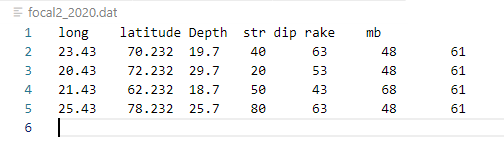
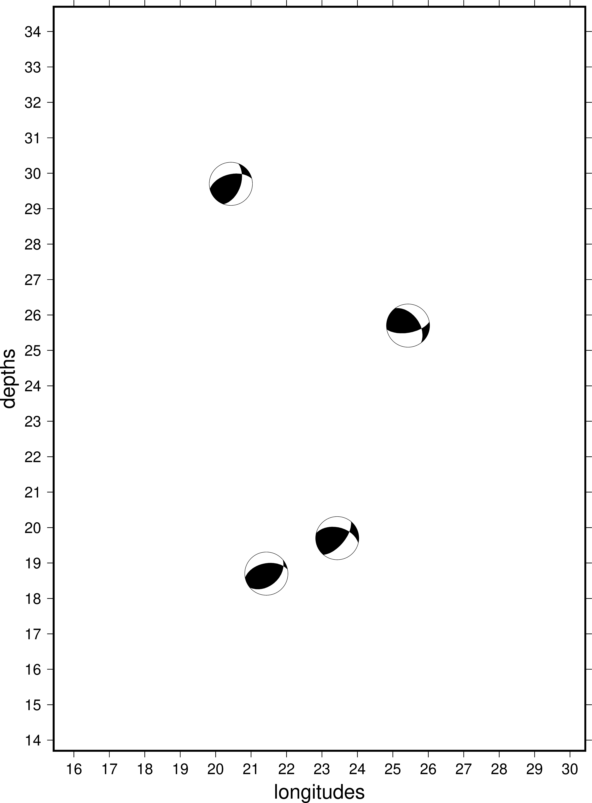

# Plotting focal mechanism solutions for depth vs (latitudes/longitudes)
```
-Utpal Kumar
17 Feb 2021
```
## Requirements:
- Python 3.8.5 or above

## Installation

### Make python environment
```
python -m venv venv
```

### Activate environment (Mac/Linux)
```
source venv/bin/activate
```
### Activate environment (Windows)
```
venv\Scripts\activate
```

### Install required packages
```
pip install pandas pygmt
```

## Data file format:


## Run program
```
python plot_depth.py
```



